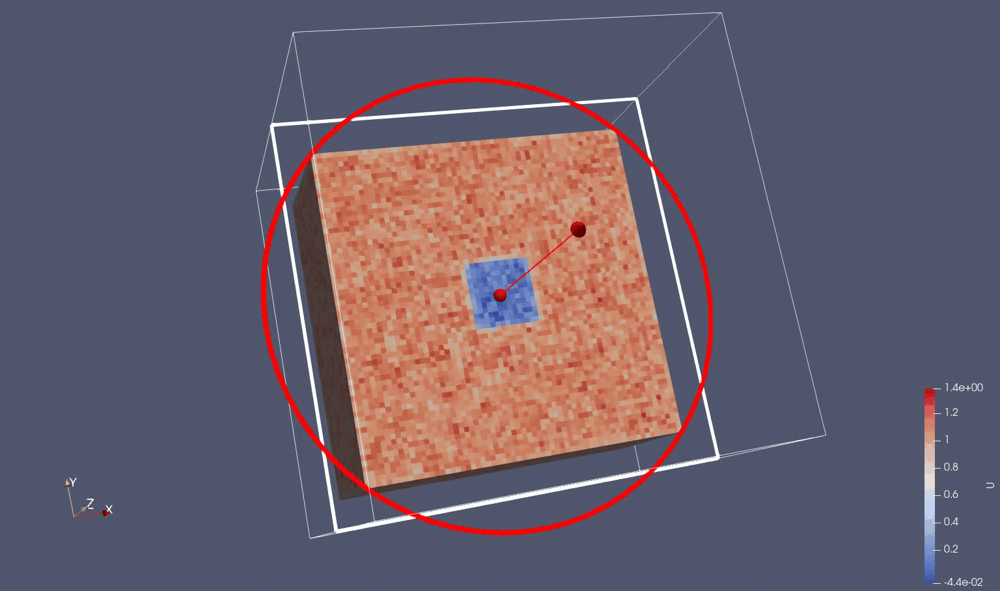
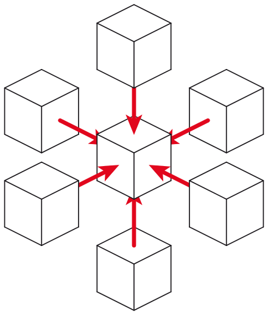

# Gray-Scott system of equations 

*Gray Scott U variable*

We use the Gray-Scott as a simple reaction-diffusion 2 variable system of equations.
The evolution of the variables are driven by a Laplacian operator, feed and kill concentration rates and a random source term in U.

$$ \frac{∂U}{∂t} = D_U \cdot \left[ \frac{∂^2U}{∂x^2} + \frac{∂^2U}{∂y^2} + \frac{∂^2U}{∂z^2}\right] - U \cdot V^2 + F \cdot (1-U) + n \cdot r $$

$$ \frac{∂V}{∂t} = D_V \cdot \left[ \frac{∂^2V}{∂x^2} + \frac{∂^2U}{∂y^2} + \frac{∂^2U}{∂z^2}\right] + U \cdot V^2 - \left( F + k \right) \cdot V $$

where: 

Outputs: 

* $$U$$ and $$V$$ are the concentrations of two reacting and diffusing chemicals

Inputs: 

* $$D_u$$ and $$D_v$$ are the respective diffusion rates
* $$F$$ is the feed rate of $$U$$ into the system
* $$k$$ is the kill rate of $$V$$ from the system
* $$n$$ is the magnitude of the noise to be added to the system
* $$r$$ is a normalized random number between -1 and 1

# Discretization and 3D Stencil Solver

We just apply the classical finite difference method to the time $$t$$ and spatial independent variables on a normalized $$\Delta\,x = \Delta\,y = \Delta\,z = 1$$ three-dimensional (3D) grid mesh: 

$$ U_{t+1, i,j,k} = U_{t, i,j,k} + \Delta t \left [ D_U \cdot \nabla^2 U_{t,i,j,k} - U_{t,i,j,k} \cdot V_{t,i,j,k}^2 + F \cdot (1-U_{t,i,j,k}) + n \cdot r_{t,i,j,k} \right ]$$

$$ V_{t+1, i,j,k} = V_{t, i,j,k} + \Delta t \left [ D_V \cdot \nabla^2 V_{t,i,j,k} + U_{t,i,j,k} \cdot V_{t,i,j,k}^2 - \left ( F + k \right) \cdot V_{t,i,j,k} \right ]$$

where the Laplacian operator is defined for the 3D 7-point stencil in normalized spatial units:

$$ \nabla^2 U_{t,i,j,k} = U_{t,i-1,j,k} + U_{t,i+1,j,k} + U_{t,i,j-1,k} + U_{t,i,j+1,k} + U_{t,i,j,k-1} + U_{t,i,j,k+1} - 6 \cdot U_{t,i,j,k} $$

where $$\Delta t$$ is an input timestep variable.

*3D 7-point stencil*

Since each new timestep value for U and V only depends on neighboring values the problem is parallelizable on CPU and GPU providing an extra memory allocation for U and V field values.
