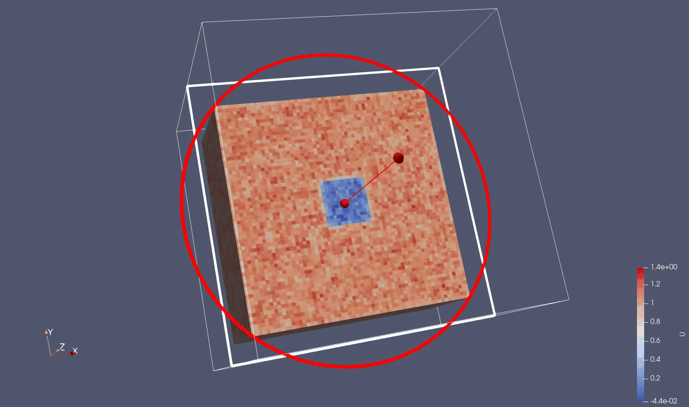

# Gray-Scott system of equations 




We use the Gray-Scott as a simple reaction-diffusion 2 variable system of equations.
The evolution of the variables are driven by a Laplacian operator, feed and kill concentration rates and a random source term in U.

<script src="https://cdn.mathjax.org/mathjax/latest/MathJax.js?config=TeX-AMS-MML_HTMLorMML" type="text/javascript"></script>


$$ \frac{∂U}{∂t} = D_u \cdot \left[ \frac{∂^2U}{∂x^2} + \frac{∂^2U}{∂y^2} + \frac{∂^2U}{∂z^2}\right] - U \cdot V^2 + F \cdot (1-u) + n \cdot r $$

$$ \frac{∂V}{∂t} = D_v \cdot \left[ \frac{∂^2V}{∂x^2} + \frac{∂^2U}{∂y^2} + \frac{∂^2U}{∂z^2}\right] + U \cdot V^2 - \left( F + k \right) \cdot V $$


where: 

* $$U$$ and $$V$$ are the concentrations of two reacting and diffusing chemicals
* $$D_u$$ and $$D_v$$ are the respective diffusion rates
* $$F$$ is the feed rate of $$U$$ into the system
* $$k$$ is the kill rate of $$V$$ from the system
* $$n$$ is the magnitude of the noise to be added to the system
* $$r$$ is a normalized random number between -1 and 1


# Discretization

```math
u_t = Du * (u_xx + u_yy + u_zz) - u * v^2 + F * (1 - u)  + noise * randn(-1,1)
v_t = Dv * (v_xx + v_yy + v_zz) + u * v^2 - (F + k) * v
```

# 3D Stencil Solver