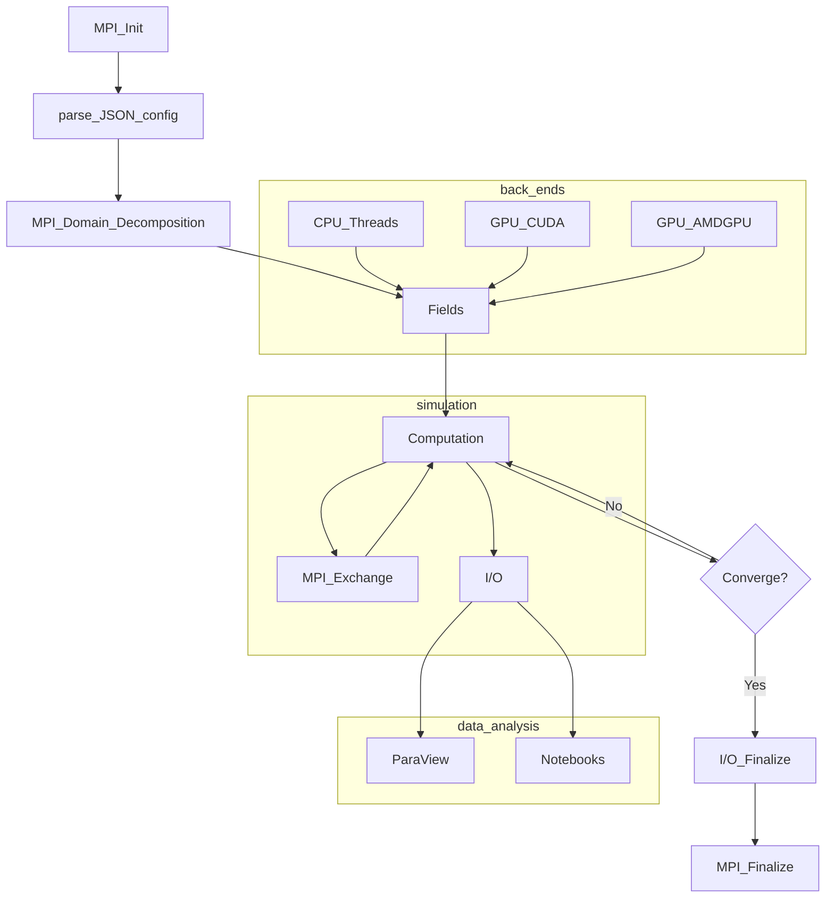

# GrayScott.jl code

The GrayScott.jl code used for this tutorial is hosted on GitHub [JuliaORNL/GrayScott.jl](https://github.com/JuliaORNL/GrayScott.jl).
The package follows a typical Julia project structure:

- `Project.toml` : project dependencies and description
- `gray-scott.jl` : Julia program passed to the `julia` executable
- `src`: source code for `module GrayScott`, `simluation` and `helper` functions
- `test`: unit and functional (WIP) tests with `julia --project test/runtests.jl`  
- `LICENSE`: MIT permissive

# Workflow

As shown below, the overall workflows is very typical in HPC simulations

**Workflow schematic**


# Run locally 

1. **Set up dependencies**

    From the `GrayScott.jl` directory instantiate and use MPI artifact jll (preferred method). To use a system provided MPI, see [here](https://juliaparallel.org/MPI.jl/latest/configuration/#using_system_mpi)

    ```julia

    $ julia --project

    Julia REPL

    julia> ]  

    (GrayScott.jl)> instantiate
    ...
    (GrayScott.jl)> <-
    julia> using MPIPreferences
    julia> MPIPreferences.use_jll_binary()
    julia> exit()
    ```

    Julia manages its own packages using [Pkg.jl](https://pkgdocs.julialang.org/v1/), the above would create platform-specific `LocalPreferences.toml` and `Manifest.toml` files.

2. **Set up the examples/settings-files.json configuration file**

    ```
    {
        "L": 64,
        "Du": 0.2,
        "Dv": 0.1,
        "F": 0.02,
        "k": 0.048,
        "dt": 1.0,
        "plotgap": 10,
        "steps": 10000,
        "noise": 0.1,
        "output": "gs-julia-1MPI-64L-F32.bp",
        "checkpoint": false,
        "checkpoint_freq": 700,
        "checkpoint_output": "ckpt.bp",
        "restart": false,
        "restart_input": "ckpt.bp",
        "adios_config": "adios2.xml",
        "adios_span": false,
        "adios_memory_selection": false,
        "mesh_type": "image",
        "precision": "Float32",
        "backend": "CPU"
    }
    ```

    The file is nearly identical to the C++ original example. 
    Not all options are currently supported, but two Julia-only options are added: 

        - "precision": either Float32 or Float64 in the array simulation (including GPUs)
        - "backend": "CPU", "CUDA" or "AMDGPU"

3. **Running the simulation**

   - `CPU threads`: launch julia assigning a number of threads (e.g. -t 8):

    ```
    $ julia --project -t 8 gray-scott.jl examples/settings-files.json
    ```

   - `CUDA/AMDGPU`: set the "backend" option in examples/settings-files.json to either "CUDA" or "AMDGPU"

    ```
    $ julia --project gray-scott.jl examples/settings-files.json
    ```

    This would generate an adios2 file from the output entry in the configuration file (e.g. `gs-julia-1MPI-64L-F32.bp`) that can be visualized with ParaView with either the VTX or the FIDES readers. 
    
    {: .warning}
    The AMDGPU.jl implementation of `randn` is currently work in progress. See related issue [here](https://github.com/JuliaGPU/AMDGPU.jl/issues/378)

## To-do list

  1. Add support including random number on device kernel code on `AMDGPU.jl`
  2. Set the domain size `L` in the configuration file as a multiple of 6 for Summit, and a multiple of 4 on Crusher
  3. Add data analysis: PDF for u and v and Julia 2D plotting capabilities: Plots.jl, Makie.jl
 