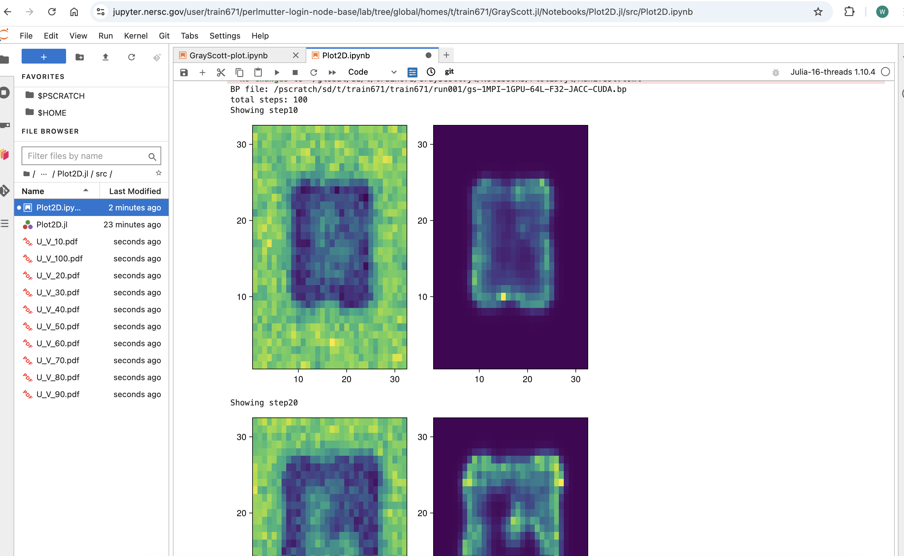

# Running Gray-Scott on Perlmutter/NERSC

This instructions are for the [Perlmutter system at NERSC](https://docs.nersc.gov/systems/perlmutter/architecture/). 

We assume the user has access to a `trnXXX` or `ntrainXXX` valid training account on NERSC with a user name `<user>`.

## Configuring Gray-Scott on Perlmutter

1. Access Perlmutter

    ```
    $ ssh <user>@perlmutter.nersc.gov
    ```

2. Obtain Gray-Scott from GitHub, first access your scrath area and create a user-specific directory, clone the repository pointing at the GrayScott-JACC branch.

    ```bash
    cd $SCRATCH
    git clone https://github.com/JuliaORNL/GrayScott.jl.git
    ```

3. Run the script prepared for this tutorial [`GrayScott.jl/scripts/config_perlmutter.sh`](https://github.com/JuliaORNL/GrayScott.jl/blob/GrayScott-JACC/scripts/config_perlmutter.sh) to set up modules, environment, and packages. This is a one-time step and might take a few minutes.

    ```bash
    source GrayScott.jl/scripts/config_perlmutter.sh
    ```

    ```bash
    #!/bin/bash
    # Packages must be installed in the parallel filesystem 
    # and not user's home directory ~/.julia (default) which does not scale
    export JULIA_DEPOT_PATH=$SCRATCH/.julia

    GS_DIR=$SCRATCH/GrayScott.jl
    # remove existing generated Manifest.toml to make this script reusable
    rm -f $GS_DIR/Manifest.toml
    rm -f $GS_DIR/LocalPreferences.toml

    # good practice to avoid conflicts with existing default modules
    module purge

    # load required modules
    module load PrgEnv-nvidia
    # this is just due to an adios2 requirement, parallel HDF5 can be added in the future
    module load cray-hdf5-parallel
    # module load nvhpc not tested, use cudatoolkit instead
    module load cudatoolkit/12.2
    module use /global/common/software/nstaff/blaschke/tutorials/julia-hpc-tutorial-icpp25/nersc/modules
    module load adios2

    # load julia module
    module load julia/1.12.1

    # Required for Julia bindings to point at underlying adios2 modules
    export JULIA_ADIOS2_PATH=/global/common/software/nstaff/blaschke/tutorials/julia-hpc-tutorial-icpp25/nersc/adios2/install/nvidia

    # Instantiate the project by installing packages in Project.toml
    julia --project=$GS_DIR -e 'using Pkg; Pkg.instantiate()'

    # MPIPreferences.jl configures MPI.jl to use the underlying Cray's MPICH
    # It will populate LocalPreferences.toml with the correct MPI binary and libraries
    julia --project=$GS_DIR -e 'using MPIPreferences; MPIPreferences.use_system_binary(mpiexec="srun", vendor="cray")'

    # Set up CUDA.jl and underlying CUDA runtime
    # this will polute Project.toml with CUDA.jl
    julia --project=$GS_DIR -e 'using JACC; JACC.set_backend("CUDA")'

    # adds an entry to LocalPreferences.toml
    julia --project=$GS_DIR -e 'using CUDA; CUDA.set_runtime_version!(v"12.2"; local_toolkit=true)'

    # Verify the packages are installed correctly
    julia --project=$GS_DIR -e 'using Pkg; Pkg.build()'
    # JACC.jl and GrayScott.jl won't precompile, but other packages will
    julia --project=$GS_DIR -e 'using Pkg; Pkg.precompile()'
    ```
    
    {: .info }
    JULIA_DEPOT_PATH is where Julia packages and artifacts (e.g. extra data) will be installed for different local environments. This is a good practice to avoid conflicts between different environments.

## Running Gray-Scott jobs on Perlmutter

1. Create an area for Gray-Scott runs outside the repository (e.g. run001, future runs will be in run002, run003, etc.)

    ```bash
    mkdir run001
    ```

2. Copy the Gray-Scott settings file and the job_perlmutter.sh to the run directory

    ```bash
    cp GrayScott.jl/examples/settings-files.json run001
    cp GrayScott.jl/scripts/job_perlmutter.sh run001
    ```

3. Submit your first job to Perlmutter - it might take a while as in any HPC system. It should generate an adios bp file output, and total runtime should be around 12 seconds using a single MPI process and NVIDIA GPU.
   
    ```bash
    cd run001
    sbatch job_perlmutter.sh
    ```

4. Check the output files generated by the job

    ```bash
    bpls -lav gs-1MPI-1GPU-64L-F32-JACC-CUDA.bp
    ```

    ```xml
    File info:
    of variables:  3
    of attributes: 13
    statistics:    Min / Max 

    double   Du                           attr   = 0.2
    double   Dv                           attr   = 0.1
    double   F                            attr   = 0.02
    string   Fides_Data_Model             attr   = "uniform"
    string   Fides_Dimension_Variable     attr   = "U"
    double   Fides_Origin                 attr   = {0, 0, 0}
    double   Fides_Spacing                attr   = {0.1, 0.1, 0.1}
    string   Fides_Variable_Associations  attr   = {"points", "points"}
    string   Fides_Variable_List          attr   = {"U", "V"}
    float    U                            100*{64, 64, 64} = -0.115931 / 1.46275
    float    V                            100*{64, 64, 64} = 0 / 1.04308
    double   dt                           attr   = 1
    double   k                            attr   = 0.048
    double   noise                        attr   = 0.1
    int32_t  step                         100*scalar = 10 / 1000
    string   vtk.xml                      attr   = 
    <VTKFile type="ImageData" version="0.1" byte_order="LittleEndian">
      <ImageData WholeExtent="0 64 0 64 0 64" Origin="0 0 0" Spacing="1 1 1">
        <Piece Extent="0 64 0 64 0 64">
          <CellData Scalars="U">
            <DataArray Name="U" />
            <DataArray Name="V" />
            <DataArray Name="TIME">
                  step
                </DataArray>
          </CellData>
        </Piece>
      </ImageData>
    </VTKFile>
    ```

5. Future runs: repeats steps 1-3 above , and edit the settings file to set the desired parameters for the Gray-Scott simulation.

   - `L` is the number of cells on each direction, Lx = Ly = Lz = L, so L^3 is the total number of cells.
   - `plotgap` is the number of steps between each visualization output.
   - `steps` is the total number of steps to run the simulation.
   - `output` is the name of the adios2 output directory dataset (can be visualized with ParaView for small cases)[docs](https://adios2.readthedocs.io/en/latest/ecosystem/visualization.html).
   - Other variables might not influence the simulation but can be changed for testing purposes.

    ```json
    {
    "L": 64,
    "Du": 0.2,
    "Dv": 0.1,
    "F": 0.02,
    "k": 0.048,
    "dt": 1.0,
    "plotgap": 10,
    "steps": 1000,
    "noise": 0.1,
    "output": "gs-1MPI-1GPU-64L-F32-JACC-CUDA.bp",
    "checkpoint": false,
    "checkpoint_freq": 700,
    "checkpoint_output": "ckpt.bp",
    "restart": false,
    "restart_input": "ckpt.bp",
    "adios_config": "adios2.xml",
    "adios_span": false,
    "adios_memory_selection": false,
    "mesh_type": "image",
    "precision": "Float32"
    }
    ```

6. Edit the launch script to request more resources: nodes, gpus, time (follow instructors directions at this point)

    ```bash
    #!/bin/bash
    #SBATCH -A ntrain7
    #SBATCH -C gpu
    #SBATCH -q shared
    #SBATCH -J gs-julia-1MPI-1GPU
    #SBATCH -o %x-%j.out
    #SBATCH -e %x-%j.err
    #SBATCH -t 0:02:00
    #SBATCH -n 1
    #SBATCH -c 32
    #SBATCH --gpus-per-task=1

    #export SLURM_CPU_BIND="cores"
    GS_DIR=$SCRATCH/$USER/GrayScott.jl
    GS_EXE=$GS_DIR/gray-scott.jl

    srun -n 1 --gpus=1 julia --project=$GS_DIR $GS_EXE settings-files.json
    ```
  
## Visualizing the output on jupyter.nersc.gov

1.  Access Perlmutter. We will stay in the $HOME directory for this step.
  
    ```
    $ ssh <user>@perlmutter.nersc.gov
    ```

2. Create a Julia kernel and environment for jupyter.nersc.gov. This is a one-time setup that will install packages in your home directory under `.julia` and kernels in `.local/share/jupyter/kernels` (might take a while)

    ```bash
    git clone https://github.com/JuliaORNL/GrayScott.jl.git
    cd GrayScott.jl/Notebooks/Plot2D.jl
    source config_Perlmutter_IJulia_kernel.sh  
    ```

    Outputs:

    ```bash
    cat config_Perlmutter_IJulia_kernel.sh
    ```

    ```bash
    
    # source this file to generate a new IJulia kernel for Perlmutter
    module load PrgEnv-nvidia
    # this is just due to an adios2 requirement, parallel HDF5 can be added in the future
    module load cray-hdf5-parallel
    # module load nvhpc not tested, use cudatoolkit instead
    module load cudatoolkit/12.2
    module use /global/common/software/nstaff/blaschke/tutorials/julia-hpc-tutorial-icpp25/nersc/modules
    module load adios2
    export JULIA_ADIOS2_PATH=/global/common/software/nstaff/blaschke/tutorials/julia-hpc-tutorial-icpp25/nersc/adios2/install/nvidia

    module load julia/1.12.1

    # instantiate project packages
    julia --project -e 'using Pkg; Pkg.instantiate()'

    # capture current environment
    julia --project -e 'using IJulia; installkernel("Julia-16-threads", "--project=@.", env=Dict("LD_LIBRARY_PATH" => string(ENV["LD_LIBRARY_PATH"]), "JULIA_NUM_THREADS" => "16", "JULIA_ADIOS2_PATH" => string(ENV["JULIA_ADIOS2_PATH"]) ))'
    ```

    ```bash
    cat ~/.local/share/jupyter/kernels/julia-16-threads-1.12/kernel.json
    ```

    ```json
    {
      "display_name": "Julia-16-threads 1.12",
      "argv": [
        "/global/common/software/nersc9/julia/1.12.1/bin/julia",
        "-i",
        "--color=yes",
        "--project=@.",
        "-e",
        "import IJulia; IJulia.run_kernel()",
        "{connection_file}"
      ],
      "language": "julia",
      "env": {
        "LD_LIBRARY_PATH": "/global/common/software/nstaff/blaschke/tutorials/julia-hpc-tutorial-icpp25/nersc/adios2/install/nvidia/lib64:/opt/nvidia/hpc_sdk/Linux_x86_64/23.9/math_libs/12.2/lib64:/opt/nvidia/hpc_sdk/Linux_x86_64/23.9/cuda/12.2/extras/CUPTI/lib64:/opt/nvidia/hpc_sdk/Linux_x86_64/23.9/cuda/12.2/extras/Debugger/lib64:/opt/nvidia/hpc_sdk/Linux_x86_64/23.9/cuda/12.2/nvvm/lib64:/opt/nvidia/hpc_sdk/Linux_x86_64/23.9/cuda/12.2/lib64:/opt/nvidia/hpc_sdk/Linux_x86_64/24.5/compilers/lib:/global/homes/w/wgodoy/adios/2.5.0/lib64:/global/common/software/nersc9/darshan/default/lib:/opt/cray/pe/papi/7.1.0.2/lib64:/opt/cray/libfabric/1.22.0/lib64",
        "JULIA_ADIOS2_PATH": "/global/common/software/nstaff/blaschke/tutorials/julia-hpc-tutorial-icpp25/nersc/adios2/install/nvidia",
        "JULIA_NUM_THREADS": "16"
      },
      "interrupt_mode": "signal"
    }
    ```

3. Start a jupyter notebook on Perlmutter login into [https://jupyter.nersc.gov/](https://jupyter.nersc.gov/) with the same user and password used to access Perlmutter.

4. Start a "Login Node" runner (might take a while).
   
5. Browse into the `GrayScott.jl/Notebooks/Plot2D.jl/src/Plot2D.ipynb` notebook and open it.
   
6. Select the `Julia-16-threads 1.12` kernel from the dropdown menu.
   
7. Run the Notebook cells (right triangle or Run menu > Run All Cells) and check you can get to the picture shown below. This is your first complete workflow from running a Gray-Scott simulation on Perlmutter high-performance computing system and visualizing the results on jupyter.nersc.gov!!!!

    
    *Gray-Scott U and V output visualization using Makie.jl and ADIOS2.jl*

8. Congratulations! You have run high-performance computing code and do the data analysis using one language.