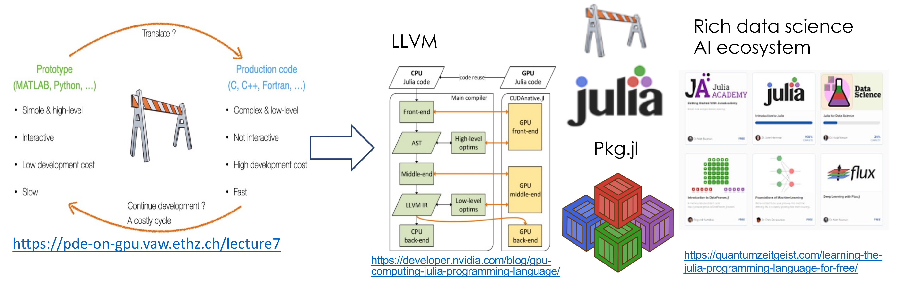

# Welcome to the Julia for High-performance Computing Tutorial

## Goal

The goal of the tutorial is to introduce an audience familiar with high-performance computing (HPC) concepts to the Julia programming language using a hands-on approach.

{: .info}
It's a good time to get Julia v1.9 installed from their [website](https://julialang.org/downloads/)

## Covered:
- Workflow aspects: simulation CPU/CPU, parallel I/O, data analysis (Notebooks)
- Multiple dispatch for array back ends (CPU, CUDA, AMDGPU)
- Multithreaded CPU using Julia @threads
- GPU programming using CUDA.jl and AMDGPU.jl
- Parallel I/O with ADIOS2.jl (outputs can be visualized in ParaView)
- Julia on OLCF's JupyterHub and Pluto.jl Notebooks (read and plot)

## Not Covered (future topics?):
- More general aspects of the language (software engineering, AI)
- AI infrastructure: Flux.jl, SciML
- Performance portability layers: e.g. KernelAbstractions.jl
- Ahead-of-time compilation: PackageCompiler.jl
- Tools ecosystem for profiling, debugging (well some)

# Why Julia?

1. Compiled via LLVM for performance. **Julia is Compiled**
2. Provides a unified **tested** ecosystem (packaging, testing, notebooks, interactivity, etc.). See JuliaCon [presentation](https://www.youtube.com/watch?v=9YWwiFbaRx8) on GeneralRegistry.
3. Community of HPC people from day-1 (the community is you, low entry barrier)
4. Sustained by [JuliaHub](https://juliahub.com/), MIT's JuliaLab, NumFocus and several open-source [contributors](https://julialang.org/blog/2019/02/julia-entities/)
5. Great math (Fortran) and data science (Python) simple syntax
6. Rapid prototyping: stay in one language+ecosystem for your custom kernels + data analysis
7. Interoperate with Fortran, C, C++ (via C), Python, R code in a lightweight manner
8. Renewed interest for high-performance + high-productivity languages
9. Great first language to expose newcomers to both HPC + math concepts
10. Contribute to HPC stack: CUDA.jl, MPI.jl, AMDGPU.jl, ADIOS2.jl, HDF5.jl...for us, by us

**Julia's value proposition**

# Why not Julia?

1. Already existing infrastructure/expertise (Fortran is perfect!)
2. Too much of an investment to learn a new language
3. Performance/productivity solutions already in place
4. Having N-language/ecosystems is not a problem
5. Python + X is well supported for your needs
6. Garbage collection, Just-in-time (JIT) compilation are issues
7. Developing low-level system libraries
8. Domain outside "technical computing"
9. Overall, you do not see any value added

## Resources

1. [Julia's value proposition for Better Scientific Software](https://bssw.io/blog_posts/julia-s-value-proposition-for-better-scientific-software). High-level intro and many resources for Scientific Software.

2. [Bridging HPC Communities through the Julia Programming Language](https://arxiv.org/abs/2211.02740)
   
3. [JuliaParallel.org](https://juliaparallel.org/resources/). Checkout the monthly HPC call and previous events: SC22 BoF, ECP BoF, Tutorial days.
   
4. [JuliaCon](https://juliacon.org/2023/)

5. [Exascale Computing Project Julia for HPC Tutorial](https://gcc02.safelinks.protection.outlook.com/?url=https%3A%2F%2Fuoregon.zoom.us%2Frec%2Fshare%2Fd09vvh4vO6tKJbpOJLragcL6ts8Fwc4_GomfVpfhPCf4RJRDZYWBIm0MVaEm6flA.SCh-WAHCuqv5zdVq&data=05%7C01%7Cgodoywf%40ornl.gov%7Ce803251ed6414930b0d008db1452f5fc%7Cdb3dbd434c4b45449f8a0553f9f5f25e%7C1%7C0%7C638126118806670838%7CUnknown%7CTWFpbGZsb3d8eyJWIjoiMC4wLjAwMDAiLCJQIjoiV2luMzIiLCJBTiI6Ik1haWwiLCJXVCI6Mn0%3D%7C3000%7C%7C%7C&sdata=0LyN5HxRKwaet3GXFfQn50S7O3JS1o6%2BNhwoOQuMgA8%3D&reserved=0).

6. [OLCF September User's Call presentations](https://www.olcf.ornl.gov/calendar/userconcall-sep2022/) 

7. [Julia for ORNL Science Workshop](https://ornl.github.io/events/jufos2022/)

8. [Julia Basics Notebooks](https://github.com/ornl-training/julia-basics). Run on myBinder or locally.

9. [From zero to Julia!](https://techytok.com/from-zero-to-julia/). Series of introductory lessons.

10. [Julia for Sustainable HPC Software](https://docs.google.com/presentation/d/1-GEFfkmwZJM44a0BOSpijMpJ8OZ54Or36Ax8LpNbBEg/edit#slide=id.g1e2ac798e0a_0_653) by Valentin Churavy.
 
# Acknowledgements

This research was supported by the Exascale Computing Project (17-SC-20-SC), a collaborative effort of the U.S. Department of Energy Office of Science and the National Nuclear Security Administration. 

[ECP PROTEAS-TUNE](https://www.ornl.gov/project/proteas-tune), [ASCR Bluestone](https://csmd.ornl.gov/Bluestone), [IDEAS](https://ideas-productivity.org/ideas-ecp/) projects, and the [Sustainable Research Pathways Program](https://shinstitute.org/sustainable-research-pathways-srp/) 

The many people in the Julia community that made this possible. Thanks to Suzanne Parete-Koon from the Oak Ridge Leadership Center (OLCF).